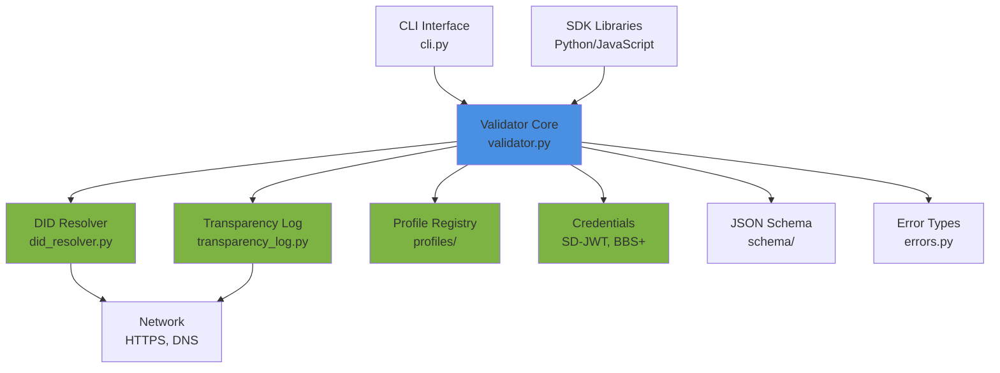
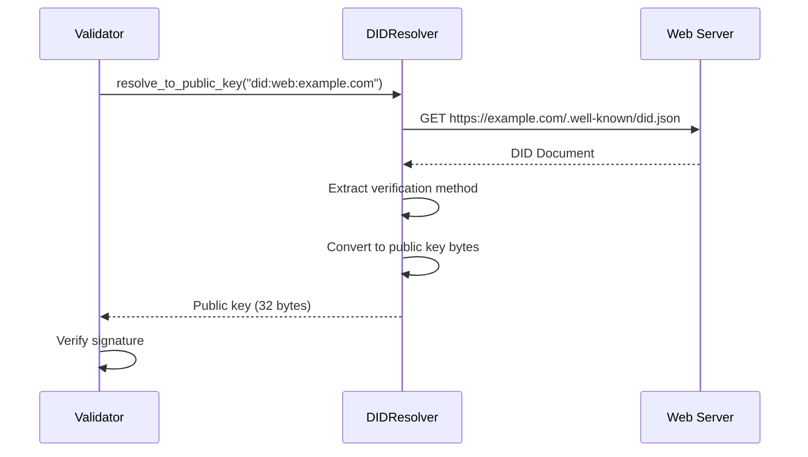
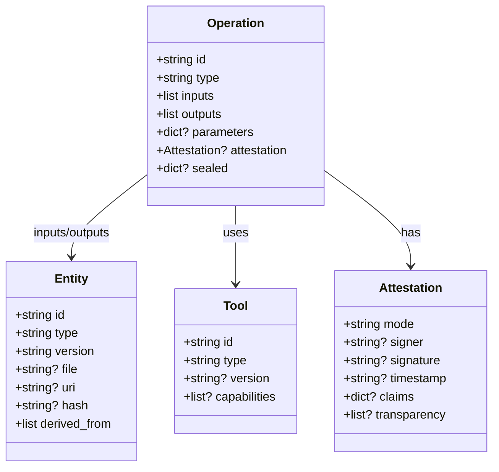
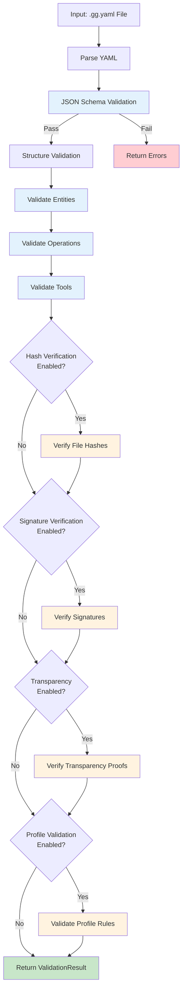

# GenesisGraph Architecture

This document describes the system architecture, component design, and implementation patterns of GenesisGraph.

## Overview

GenesisGraph is designed as a modular, extensible provenance validation and generation framework with cryptographic verification capabilities.

### Design Principles

1. **Progressive Trust**: Start with basic validation, add cryptographic verification as needed
2. **Modular Architecture**: Components can be used independently
3. **Graceful Degradation**: Core functionality works even if optional dependencies are missing
4. **Security First**: Input validation, path traversal protection, DoS prevention
5. **Performance**: Efficient validation for large documents (10,000+ entities)

## System Architecture



## Core Components

### 1. Validator (`genesisgraph/validator.py`)

**Purpose**: Central validation engine for GenesisGraph documents

**Key Responsibilities:**
- Schema validation (JSON Schema)
- Entity validation (IDs, types, hashes)
- Operation validation (inputs/outputs, attestations)
- Tool validation (types, capabilities)
- Hash verification (SHA256, SHA512, Blake3)
- Signature verification (Ed25519, ECDSA, RSA)
- Transparency log verification (RFC 6962)
- Profile-specific validation (industry standards)

**Architecture:**

```
┌─────────────────────────────────────────────┐
│      GenesisGraphValidator                  │
├─────────────────────────────────────────────┤
│ Public API:                                 │
│  • validate(data) → ValidationResult        │
│  • validate_file(path) → ValidationResult   │
├─────────────────────────────────────────────┤
│ Internal Methods:                           │
│  • _validate_entities()                     │
│  • _validate_operations()                   │
│  • _validate_tools()                        │
│  • _validate_attestation()                  │
│  • _verify_signature()                      │
│  • _verify_file_hash()                      │
│  • _verify_transparency_anchoring()         │
│  • _verify_sd_jwt_attestation()             │
│  • _verify_bbs_plus_attestation()           │
│  • _canonical_json()                        │
├─────────────────────────────────────────────┤
│ Dependencies:                               │
│  • DIDResolver (optional)                   │
│  • TransparencyLogVerifier (optional)       │
│  • ProfileRegistry (optional)               │
│  • SD-JWT/BBS+ verifiers (optional)         │
└─────────────────────────────────────────────┘
```

**Security Features:**
- Input size limits (MAX_ENTITIES, MAX_OPERATIONS, MAX_TOOLS)
- ID length limits (MAX_ID_LENGTH)
- Hash/signature length limits
- Path traversal protection (absolute paths, `..` references)
- Safe YAML parsing
- DoS prevention (bounded loops, size checks)

### 2. DID Resolver (`genesisgraph/did_resolver.py`)

**Purpose**: Resolve Decentralized Identifiers to public keys for signature verification

**Supported Methods:**
- `did:key` - Self-describing cryptographic keys
- `did:web` - Web-based DIDs (HTTPS + well-known URLs)
- `did:ion` - Bitcoin-anchored Sidetree DIDs
- `did:ethr` - Ethereum-based DIDs

**Architecture:**

```
┌─────────────────────────────────────────────┐
│           DIDResolver                       │
├─────────────────────────────────────────────┤
│ Public API:                                 │
│  • resolve(did) → DIDDocument               │
│  • resolve_to_public_key(did) → bytes       │
├─────────────────────────────────────────────┤
│ Method Handlers:                            │
│  • _resolve_did_key()                       │
│  • _resolve_did_web()                       │
│  • _resolve_did_ion()                       │
│  • _resolve_did_ethr()                      │
├─────────────────────────────────────────────┤
│ Security:                                   │
│  • SSRF protection (did:web)                │
│  • TLS certificate validation               │
│  • Rate limiting                            │
│  • Timeout enforcement                      │
│  • Caching (TTL-based)                      │
└─────────────────────────────────────────────┘
```

**Example Flow:**



### 3. Transparency Log Verifier (`genesisgraph/transparency_log.py`)

**Purpose**: Verify Certificate Transparency-style inclusion proofs (RFC 6962)

**Key Features:**
- Merkle tree inclusion proof verification
- Consistency proof verification
- Multi-witness validation (cross-log verification)
- Offline verification (cached proofs)
- Trillian and Rekor (Sigstore) integration

**Architecture:**

```
┌─────────────────────────────────────────────┐
│      TransparencyLogVerifier                │
├─────────────────────────────────────────────┤
│ Public API:                                 │
│  • verify_inclusion_proof()                 │
│  • verify_consistency_proof()               │
│  • verify_multi_witness()                   │
├─────────────────────────────────────────────┤
│ Internal:                                   │
│  • _compute_merkle_root()                   │
│  • _hash_leaf()                             │
│  • _hash_children()                         │
│  • _fetch_proof_from_log() (optional)       │
├─────────────────────────────────────────────┤
│ Integration:                                │
│  • Trillian (Google)                        │
│  • Rekor (Sigstore)                         │
│  • Custom RFC 6962 logs                     │
└─────────────────────────────────────────────┘
```

**Verification Flow:**

```
Transparency Log Entry
        │
        ▼
  Leaf Hash = SHA256(0x00 || data)
        │
        ▼
  Inclusion Proof (sibling hashes)
        │
        ▼
  Merkle Root Computation
   ┌────┴────┐
   │         │
   A         B
  ┌┴┐       ┌┴┐
  1 2       3 4
        │
        ▼
  Compare with Tree Root
        │
        ▼
   ✓ Valid / ✗ Invalid
```

### 4. Profile Registry (`genesisgraph/profiles/`)

**Purpose**: Industry-specific validation rules and compliance checking

**Included Profiles:**
- `gg-ai-basic-v1` - AI/ML pipeline validation
- `gg-cam-v1` - Computer-aided manufacturing

**Architecture:**

```
┌─────────────────────────────────────────────┐
│        ProfileRegistry                      │
├─────────────────────────────────────────────┤
│ • register_profile()                        │
│ • get_profile()                             │
│ • validate_with_profile()                   │
└──────────────┬──────────────────────────────┘
               │
       ┌───────┴───────┐
       │               │
  AIBasicV1      CAMV1Profile
  Profile          Validator
       │               │
  Validates:      Validates:
  • AI params     • ISO 9001
  • FDA 21 CFR    • Tolerances
  • Human review  • Calibration
  • Data lineage  • QC checkpoints
```

**Profile Validation:**

```python
class AIBasicV1ProfileValidator:
    def validate(self, data: Dict) -> ProfileValidationResult:
        errors = []
        
        # Check AI-specific requirements
        for op in data.get('operations', []):
            if op['type'] == 'ai_inference':
                # Require temperature parameter
                if 'temperature' not in op.get('parameters', {}):
                    errors.append("AI inference requires temperature")
                
                # Require human review for high-stakes
                if not self._has_human_review(op):
                    errors.append("High-stakes AI requires human review")
        
        return ProfileValidationResult(errors=errors)
```

## Data Model

### Core Types



### Document Structure

```yaml
spec_version: "0.1.0"
profile: "gg-ai-basic-v1"  # Optional

entities:
  - id: <entity-id>
    type: Dataset|Model|File|...
    version: <version>
    file: <path>
    hash: sha256:...
    derived_from: [...]

operations:
  - id: <operation-id>
    type: transformation|ai_inference|...
    inputs: [<entity-id>, ...]
    outputs: [<entity-id>, ...]
    parameters:
      <key>: <value>
    attestation:
      mode: basic|signed|verifiable|zk|sd-jwt|bbs-plus
      signer: <did>
      signature: <algorithm>:<data>
      timestamp: <iso8601>

tools:
  - id: <tool-id>
    type: Software|AIModel|Machine|...
    version: <version>
```

## Validation Flow



## Security Architecture

### Threat Model

**Addressed Threats:**
1. **Malicious Documents** - Schema validation, size limits
2. **Path Traversal** - Path normalization, parent directory checks
3. **DoS Attacks** - Input size limits, timeout enforcement
4. **Signature Forgery** - Cryptographic verification via DID resolution
5. **Data Tampering** - Hash verification, Merkle inclusion proofs
6. **SSRF (did:web)** - URL validation, private IP blocking, TLS enforcement

**Trust Assumptions:**
- DID resolution endpoints are honest (can be cached/pinned)
- Transparency log operators are honest (multi-witness mitigates)
- Signature private keys are secured by signers
- Hash algorithms (SHA256, Ed25519) are secure

### Defense Layers

```
┌─────────────────────────────────────────────┐
│  Layer 1: Input Validation                  │
│  • Schema validation                        │
│  • Size limits (entities, ops, tools)       │
│  • ID/hash length limits                    │
└──────────────────┬──────────────────────────┘
                   │
┌──────────────────▼──────────────────────────┐
│  Layer 2: Path Security                     │
│  • Absolute path rejection                  │
│  • Parent directory rejection (..)          │
│  • Path normalization                       │
└──────────────────┬──────────────────────────┘
                   │
┌──────────────────▼──────────────────────────┐
│  Layer 3: Cryptographic Verification        │
│  • Hash verification (SHA256/512)           │
│  • Signature verification (Ed25519)         │
│  • Canonical JSON for signing               │
└──────────────────┬──────────────────────────┘
                   │
┌──────────────────▼──────────────────────────┐
│  Layer 4: Network Security (DID resolution) │
│  • SSRF protection                          │
│  • TLS certificate validation               │
│  • Rate limiting                            │
│  • Timeout enforcement                      │
└──────────────────┬──────────────────────────┘
                   │
┌──────────────────▼──────────────────────────┐
│  Layer 5: Transparency & Auditability       │
│  • Merkle inclusion proofs                  │
│  • Multi-witness verification               │
│  • Tamper-evident audit trails              │
└─────────────────────────────────────────────┘
```

## Design Decisions

### 1. Progressive Validation Modes

**Decision**: Support multiple attestation modes (basic, signed, verifiable, zk, sd-jwt, bbs-plus)

**Rationale**:
- Start simple (basic timestamps) for development
- Add cryptography (signed) for production
- Enable privacy (sd-jwt, bbs+) for sensitive data
- Support zero-knowledge (zk) for advanced use cases

**Trade-offs**:
- Complexity: More modes = more code
- Benefit: Flexibility for different trust requirements

### 2. Optional Dependencies

**Decision**: Core validation works without cryptography, DID resolution, or transparency logs

**Rationale**:
- Basic validation doesn't need network access
- Development environments may not need full crypto stack
- Installation is simpler

**Trade-offs**:
- More error handling (check if libraries available)
- Benefit: Easier adoption, faster installation

### 3. Canonical JSON for Signing

**Decision**: Use RFC 8785-style canonical JSON (sorted keys, no whitespace)

**Rationale**:
- Deterministic signature verification
- Compatible with other standards (JWT, JWS)
- Simple to implement

**Example**:
```python
canonical_json({"z": 1, "a": 2})  # → '{"a":2,"z":1}'
```

### 4. Merkle Tree Format (RFC 6962)

**Decision**: Use Certificate Transparency log format for transparency anchoring

**Rationale**:
- Battle-tested (used by Google Chrome, Let's Encrypt)
- Well-specified (RFC 6962, RFC 9162)
- Existing infrastructure (Trillian, Rekor)
- Multi-witness support

**Trade-offs**:
- More complex than simple hash chains
- Benefit: Industry standard, proven at scale

### 5. DID-based Identity

**Decision**: Use Decentralized Identifiers (DIDs) instead of X.509 certificates

**Rationale**:
- No centralized certificate authority
- Self-sovereign identity
- Multiple verification methods per identity
- Supports rotation and revocation

**Trade-offs**:
- Less familiar than PKI
- Benefit: More flexible, future-proof

## Extension Points

### Custom Profile Validators

```python
from genesisgraph.profiles import BaseProfileValidator

class MyCustomProfile(BaseProfileValidator):
    profile_id = "my-custom-profile-v1"
    
    def validate(self, data: Dict) -> ProfileValidationResult:
        # Custom validation logic
        errors = []
        # ... check domain-specific rules ...
        return ProfileValidationResult(errors=errors)

# Register
from genesisgraph.profiles import ProfileRegistry
registry = ProfileRegistry()
registry.register_profile(MyCustomProfile())
```

### Custom DID Methods

```python
from genesisgraph.did_resolver import DIDResolver

class MyDIDResolver(DIDResolver):
    def _resolve_did_custom(self, did: str) -> dict:
        # Custom resolution logic
        return did_document
```

### Custom Attestation Modes

Add new attestation mode by extending `_validate_attestation()` method.

## Performance Characteristics

### Validation Performance

| Document Size | Entities | Operations | Validation Time | Memory |
|---------------|----------|------------|-----------------|--------|
| Small         | 10       | 5          | < 10ms          | ~10MB  |
| Medium        | 100      | 50         | < 100ms         | ~20MB  |
| Large         | 1,000    | 500        | < 1s            | ~50MB  |
| Very Large    | 10,000   | 5,000      | < 10s           | ~200MB |

**Bottlenecks:**
1. Hash verification on large files (I/O bound)
2. Network calls for DID resolution (can be cached)
3. Transparency log proof verification (CPU bound, Merkle tree traversal)

**Optimizations:**
- Parallel hash verification (future enhancement)
- DID document caching (implemented)
- Lazy loading for large documents (planned)

### Scalability

**Current Limits** (configured in validator.py):
- MAX_ENTITIES: 10,000
- MAX_OPERATIONS: 10,000
- MAX_TOOLS: 1,000
- MAX_ID_LENGTH: 256 characters
- MAX_HASH_LENGTH: 512 characters
- MAX_SIGNATURE_LENGTH: 4,096 characters

**For larger documents:**
- Split into multiple files with cross-references
- Use streaming validation (future enhancement)
- Use distributed validation (future enhancement)

## Testing Strategy

### Test Coverage

Target: **90%+ coverage**

Current coverage (v0.3.0):
- validator.py: ~85%
- did_resolver.py: ~90%
- transparency_log.py: ~95%
- cli.py: ~60%

### Test Types

1. **Unit Tests** (`tests/test_*.py`)
   - Individual function testing
   - Edge cases
   - Error handling

2. **Integration Tests** (`tests/test_integration.py`)
   - End-to-end workflows
   - Multiple components together
   - Real file validation

3. **Security Tests** (`tests/test_security.py`)
   - Path traversal prevention
   - Input size limits
   - Injection attacks

4. **Performance Tests** (`tests/test_performance.py`)
   - Benchmark validation speed
   - Memory usage profiling
   - Regression detection

### Test Fixtures

```
tests/fixtures/
├── valid/
│   ├── minimal.gg.yaml
│   ├── level-a-full-disclosure.gg.yaml
│   ├── level-b-partial-envelope.gg.yaml
│   └── level-c-sealed-subgraph.gg.yaml
├── invalid/
│   ├── missing-spec-version.gg.yaml
│   ├── invalid-hash-format.gg.yaml
│   └── duplicate-entity-id.gg.yaml
└── security/
    ├── path-traversal-attempt.gg.yaml
    └── oversized-document.gg.yaml
```

## Future Enhancements

### Planned (v0.4.0)

- [ ] Full Blake3 hash support
- [ ] ECDSA and RSA signature verification
- [ ] Parallel hash verification
- [ ] Streaming validation for large documents
- [ ] GraphQL API for querying provenance

### Under Consideration (v0.5.0+)

- [ ] Distributed validation (multi-node)
- [ ] Real-time validation (webhook support)
- [ ] Provenance query language
- [ ] Machine learning model verification
- [ ] Hardware attestation (TPM, SGX)

---

**Last updated:** 2025-11-20
**Applies to:** GenesisGraph v0.3.0
