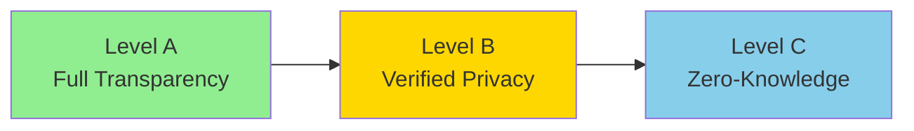
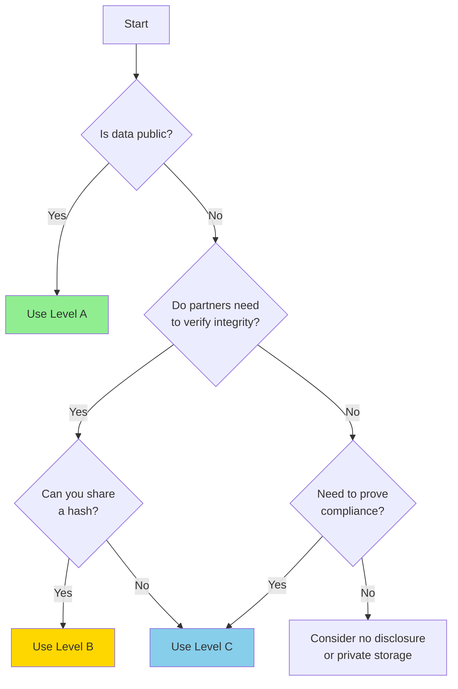

# Disclosure Levels (A/B/C)

The three-level disclosure model is **GenesisGraph's core innovation**. It solves the privacy-vs-trust dilemma by letting you choose how much to reveal while maintaining verifiability.

## The Problem GenesisGraph Solves

Traditional provenance systems force a binary choice:

| **Full Transparency** | **No Transparency** |
|----------------------|---------------------|
| ✅ Maximum trust | ✅ Maximum privacy |
| ❌ No privacy | ❌ No trust |
| Used: Open source, public data | Used: Proprietary systems |

**This doesn't work for:** Enterprise collaboration, regulated industries, competitive R&D, sensitive data processing

## GenesisGraph's Three-Level Model

GenesisGraph provides a spectrum:



You choose the level **per node** in your provenance graph - mix and match as needed!

---

## Level A: Full Transparency

**Philosophy:** "Trust through complete openness"

### What You Share
✅ All details: file locations, parameters, agent versions, timestamps
✅ Public hashes for verification
✅ Full metadata

### When to Use
- **Open science** - Reproducible research requiring full disclosure
- **Public datasets** - Government data, open source projects
- **Supply chain** - Consumer-facing product provenance
- **Audits** - Regulatory compliance requiring full records

### Example

```yaml
disclosure: A
nodes:
  - id: training-dataset
    type: Input
    label: "ImageNet-2024"
    location: "https://image-net.org/data/imagenet2024.tar.gz"
    hash:
      algorithm: sha256
      value: "d4e5f6a7b8c9d0e1f2a3b4c5d6e7f8a9b0c1d2e3f4a5b6c7d8e9f0a1b2c3d4e5"
    metadata:
      size: "150GB"
      format: "tar.gz"
      license: "CC BY-SA 4.0"

  - id: training-process
    type: Process
    label: "Model Training"
    agent:
      id: "did:key:z6MkhaXg..."
      name: "PyTorch Training Pipeline"
      version: "2.1.0"
    parameters:
      epochs: 100
      batch_size: 32
      learning_rate: 0.001
      optimizer: "Adam"
    environment:
      hardware: "NVIDIA A100 80GB"
      os: "Ubuntu 22.04"
      cuda: "12.1"
    timestamps:
      started: "2024-01-15T10:00:00Z"
      completed: "2024-01-18T22:30:00Z"
```

**Result:** Complete transparency - anyone can reproduce or verify every detail

---

## Level B: Verified Privacy

**Philosophy:** "Trust through verifiable integrity without revealing details"

### What You Share
✅ Cryptographic hashes (proves integrity)
✅ Minimal metadata (type, general category)
✅ Verification method
❌ Actual locations, parameters, or sensitive details

### When to Use
- **Enterprise collaboration** - Working with partners while protecting IP
- **Regulated industries** - Healthcare (HIPAA), finance (PCI-DSS)
- **Competitive R&D** - Proving due diligence without revealing techniques
- **Sensitive data** - Government, defense, private customer data

### Example

```yaml
disclosure: B
nodes:
  - id: training-dataset
    type: Input
    label: "Proprietary Medical Images"
    hash:
      algorithm: sha256
      value: "d4e5f6a7b8c9d0e1f2a3b4c5d6e7f8a9b0c1d2e3f4a5b6c7d8e9f0a1b2c3d4e5"
    # Location NOT disclosed - privacy preserved
    # Can still verify integrity via hash

  - id: training-process
    type: Process
    label: "Model Training"
    agent:
      id: "did:web:example.com:ai-lab"
      # Verified identity, but no version details
    hash:
      algorithm: sha256
      value: "a1b2c3d4e5f6a7b8c9d0e1f2a3b4c5d6e7f8a9b0c1d2e3f4a5b6c7d8e9f0a1b2"
    # Parameters NOT disclosed - competitive advantage protected
    # Hash proves process integrity

    timestamps:
      started: "2024-01-15T10:00:00Z"
      completed: "2024-01-18T22:30:00Z"
      # Timing shown, but not configuration details
```

**Result:** Verifiable integrity + privacy. Auditors can confirm "this exact process ran" without learning details

---

## Level C: Zero-Knowledge Proofs

**Philosophy:** "Trust through cryptographic proof without revealing anything"

### What You Share
✅ Cryptographic proofs (proves properties)
✅ Proof type and verification method
❌ No hashes, no metadata, no details whatsoever

### When to Use
- **Maximum privacy** - Competitive algorithms, state secrets
- **Compliance proofs** - "I followed regulations" without revealing what you did
- **Predicate proofs** - "My data meets criteria X" without showing the data
- **Unlinkable verification** - Prove compliance without linking to identity

### Example

```yaml
disclosure: C
nodes:
  - id: training-dataset
    type: Input
    proofs:
      - type: "predicate-proof"
        claim: "dataset size >= 100GB"
        proof: "zkp:snark:0x1a2b3c4d5e6f7a8b9c0d1e2f3a4b5c6d7e8f9a0b1c2d3e4f5a6b7c8d9e0f1a2b"
        verifier: "did:web:example.com:zkp-verifier"

      - type: "compliance-proof"
        claim: "HIPAA-compliant data handling"
        proof: "zkp:bulletproof:0x9f8e7d6c5b4a3f2e1d0c9b8a7f6e5d4c3b2a1f0e9d8c7b6a5f4e3d2c1b0a9f8e"
        standard: "HIPAA-2023"

  - id: training-process
    type: Process
    proofs:
      - type: "parameter-range-proof"
        claim: "learning_rate in [0.0001, 0.01]"
        proof: "zkp:rangeproof:0x2b3c4d5e6f7a8b9c0d1e2f3a4b5c6d7e8f9a0b1c2d3e4f5a6b7c8d9e0f1a2b3c"

      - type: "execution-proof"
        claim: "process ran on certified hardware"
        proof: "zkp:sigma:0x4e5f6a7b8c9d0e1f2a3b4c5d6e7f8a9b0c1d2e3f4a5b6c7d8e9f0a1b2c3d4e5f"
        attestation: "SGX-2024"
```

**Result:** Cryptographic proof of properties (compliance, ranges, attestations) without revealing **any** underlying data

---

## Comparing the Three Levels

| **Aspect** | **Level A** | **Level B** | **Level C** |
|-----------|------------|------------|------------|
| **Privacy** | None (public) | High (hashed) | Maximum (ZKP) |
| **Trust** | Full transparency | Hash verification | Cryptographic proof |
| **Reproducibility** | Complete | Partial (with key) | Proof-based only |
| **Verification Cost** | Low (hash check) | Low (hash check) | Higher (ZKP verify) |
| **Use Case** | Open science | Enterprise | Competitive R&D |
| **Example** | Public dataset URL | Hash of private data | Proof of compliance |

## Mixing Levels in One Graph

**Key Feature:** You can use different levels for different nodes!

```yaml
nodes:
  # Public input - full transparency
  - id: public-dataset
    disclosure: A
    location: "https://github.com/example/data.zip"
    hash: "sha256:abc123..."

  # Proprietary algorithm - verified privacy
  - id: processing-step
    disclosure: B
    hash: "sha256:def456..."
    # Algorithm details hidden

  # Sensitive output - zero-knowledge proof
  - id: final-model
    disclosure: C
    proofs:
      - type: "accuracy-proof"
        claim: "accuracy >= 95%"
        proof: "zkp:proof_data..."
```

**Why this works:** Different stakeholders need different levels of trust:
- **Public** (Level A): Consumers trust transparent sources
- **Partners** (Level B): Verify integrity without revealing IP
- **Regulators** (Level C): Prove compliance without exposing trade secrets

## How to Choose the Right Level

### Decision Flow



### Quick Reference

| **Question** | **Answer** | **Use Level** |
|-------------|-----------|---------------|
| "Can competitors see this?" | No | B or C |
| "Must prove to regulators?" | Yes | C (if sensitive) or A (if public) |
| "Open source project?" | Yes | A |
| "Collaborating with partners?" | Yes | B |
| "Consumer-facing product?" | Yes | A |
| "Proprietary algorithm?" | Yes | B or C |
| "Healthcare/financial data?" | Yes | B or C |
| "Research reproducibility?" | Yes | A |

## Implementation Examples

### Example 1: Pharmaceutical R&D

```yaml
# Clinical trial provenance - mixed levels
nodes:
  # Trial design - public for transparency
  - id: trial-protocol
    disclosure: A
    location: "https://clinicaltrials.gov/study/NCT123456"

  # Patient data - verified but private
  - id: patient-data
    disclosure: B
    hash: "sha256:abc123..."
    # HIPAA-protected

  # Drug formulation - zero-knowledge proof
  - id: drug-synthesis
    disclosure: C
    proofs:
      - type: "fda-compliance-proof"
        claim: "21 CFR Part 11 compliant"
        proof: "zkp:proof..."
```

### Example 2: AI Model Supply Chain

```yaml
nodes:
  # Training code - open source
  - id: training-code
    disclosure: A
    location: "https://github.com/example/model-training"

  # Training data - proprietary
  - id: training-data
    disclosure: B
    hash: "sha256:def456..."

  # Model weights - competitive
  - id: model-output
    disclosure: C
    proofs:
      - type: "performance-proof"
        claim: "accuracy >= 98%"
        proof: "zkp:proof..."
```

## Best Practices

### 1. Start with the Minimum Necessary Disclosure
- Use Level C by default
- Increase to B if partners need hash verification
- Use A only for public/open data

### 2. Document Your Disclosure Choices
```yaml
metadata:
  disclosure_rationale: "Level B used to protect IP while enabling partner verification"
```

### 3. Consider Your Audience
- **Regulators:** May require Level A for audits
- **Partners:** Usually satisfied with Level B
- **Competitors:** Definitely use Level C
- **Public:** Level A builds consumer trust

### 4. Use Transparency Logs for Level B/C
Even with privacy, you can prove "when" something happened:
```yaml
disclosure: B
transparency_log:
  log_id: "https://rekor.sigstore.dev"
  entry_id: "abc123..."
  # Proves graph existed at timestamp, without revealing content
```

## Advanced: Selective Disclosure

For even more control, use **Selective Disclosure** cryptography:
- Reveal only specific fields to specific parties
- Same graph, different views for different audiences

→ See [Selective Disclosure Guide](selective-disclosure.md)

## Next Steps

<div class="grid cards" markdown>

- **Set up identity** → [DID & Identity Guide](did-web-guide.md)
- **Implement Level B/C** → [Selective Disclosure](selective-disclosure.md)
- **Add audit trails** → [Transparency Logs](transparency-log.md)
- **Industry compliance** → [Profile Validators](profile-validators.md)

</div>

---

**Questions?** Check the [FAQ](../faq.md) or see [Use Cases](../use-cases.md) for real-world examples
