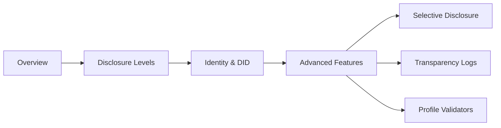

# User Guide Overview

Welcome to the GenesisGraph User Guide! This guide will help you understand how to use GenesisGraph effectively.

## What You'll Learn

This user guide is organized progressively, from core concepts to advanced features:



## Core Concept: Selective Disclosure

**The Problem:** Traditional provenance systems force you to choose:
- **Full transparency** (publish everything, lose privacy)
- **No transparency** (keep everything private, lose trust)

**GenesisGraph's Solution:** Three-level selective disclosure model

### Disclosure Level A: Full Transparency
✅ Use when: Public data, open science, supply chain verification

```yaml
disclosure: A
nodes:
  - id: input-1
    type: Input
    label: "training-data.zip"
    location: "https://example.com/data.zip"  # Full details
    hash: "sha256:abc123..."
```

**Shows:** Everything - files, locations, parameters, agent details

### Disclosure Level B: Verified Privacy
✅ Use when: Enterprise collaboration, regulated industries, competitive IP

```yaml
disclosure: B
nodes:
  - id: input-1
    type: Input
    label: "training-data.zip"
    hash: "sha256:abc123..."  # Provable integrity
    # location omitted - private but verifiable
```

**Shows:** Enough to verify integrity, hides sensitive details

### Disclosure Level C: Zero-Knowledge Proofs
✅ Use when: Maximum privacy, compliance proofs, competitive advantage

```yaml
disclosure: C
nodes:
  - id: input-1
    type: Input
    proofs:
      - type: "hash-commitment"
        proof: "zkp:proof_data..."  # Cryptographic proof only
```

**Shows:** Only cryptographic proofs, reveals nothing about the data itself

## How Disclosure Works in Practice

| **What You Want to Prove** | **Disclosure Level** | **What You Share** |
|----------------------------|----------------------|---------------------|
| "I used this exact file" | A | File location + hash |
| "I used a verified file" | B | Hash only |
| "I used a compliant file" | C | Zero-knowledge proof |
| "This process ran on certified hardware" | A | Hardware ID + cert |
| "This process ran on secure hardware" | B | Cert hash |
| "This process met security standards" | C | ZKP of compliance |

## User Guide Structure

This guide follows an incremental reveal approach:

### 1. **Start Here: Disclosure Levels (A/B/C)**
Learn the three-level model in depth
→ [Disclosure Levels Guide](disclosure-levels.md)

### 2. **Identity & DIDs**
Understand how GenesisGraph uses decentralized identifiers for trust
→ [DID & Identity Guide](did-web-guide.md)

### 3. **Advanced Features**

Once you understand the basics, explore advanced capabilities:

- **[Selective Disclosure](selective-disclosure.md)** - SD-JWT and BBS+ cryptographic techniques
- **[Transparency Logs](transparency-log.md)** - Certificate Transparency for tamper-proof audit trails
- **[Profile Validators](profile-validators.md)** - Industry-specific compliance (FDA, ISO, etc.)

## Common Use Cases

**Quick Navigation by Role:**

<div class="grid cards" markdown>

- **🤖 AI/ML Engineers**

  Track model training, validate datasets, prove compliance
  → [AI Pipeline Examples](../use-cases.md#ai-pipelines)

- **🏭 Manufacturing**

  CAD provenance, ISO 9001 compliance, supply chain verification
  → [Manufacturing Examples](../use-cases.md#manufacturing)

- **🔬 Researchers**

  Reproducible science, data lineage, peer review
  → [Scientific Research Examples](../use-cases.md#scientific-research)

- **🏢 Enterprises**

  Cross-organization collaboration with privacy
  → [Enterprise Identity Guide](did-web-guide.md)

</div>

## How to Use This Guide

### For Beginners
1. Read this overview
2. Understand [Disclosure Levels](disclosure-levels.md)
3. Try the [Examples](../getting-started/examples.md)

### For Implementers
1. Review [Disclosure Levels](disclosure-levels.md)
2. Set up [DID & Identity](did-web-guide.md)
3. Choose features: [Selective Disclosure](selective-disclosure.md), [Transparency Logs](transparency-log.md), or [Profile Validators](profile-validators.md)
4. See [Architecture](../developer-guide/architecture.md) for integration

### For Decision Makers
1. Read this overview
2. Check [Use Cases & FAQ](../use-cases.md)
3. Review [Vision & Strategy](../strategic/vision.md)

## Next Steps

<div class="grid cards" markdown>

- **Master disclosure levels** → [Disclosure Levels (A/B/C)](disclosure-levels.md)
- **Set up identity** → [DID & Identity Guide](did-web-guide.md)
- **See real examples** → [Use Cases](../use-cases.md)
- **Deep dive** → [Main Specification](../specifications/main-spec.md)

</div>

## Need Help?

- **Common questions:** [FAQ](../faq.md)
- **Technical issues:** [Troubleshooting](../developer-guide/troubleshooting.md)
- **Integration help:** [Architecture Guide](../developer-guide/architecture.md)

---

**Ready to start?** → [Learn about Disclosure Levels](disclosure-levels.md)
